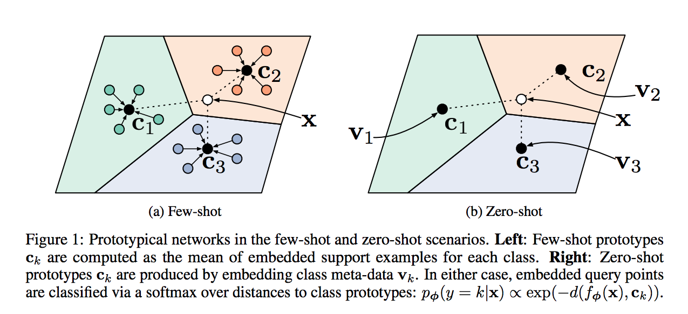

# Prototypical Networks for Few-shot Learning

> Reimplementation of the NIPS 2017 Paper "Prototypical Networks for Few-shot Learning"
> by Snell, Jake and Swersky, Kevin and Zemel, Richard


## Prototypical Networks

Prototypical networks learn ametric space in which classification can be
performed by computing distances to prototype representations of each class.

<p align="center">
  
</p>


## Installation

Requiring `Python 3.6`, because of dependence on `typing` and `f-string`,
execute from the root of the project:

```bash
$ source scripts/setup.sh
```


## Data


### Omniglot Data Set

[Omniglot](https://cims.nyu.edu/~brenden/LakeEtAl2011CogSci.pdf)
is a dataset of 1623 handwritten characters collected from 50 alphabets.
There are 20 examples associated with each character,
where each example is drawn by a different human subject.


#### Data Splits

Following the Vynials splitting method as in [Matching Networks for One Shot Learning](https://papers.nips.cc/paper/6385-matching-networks-for-one-shot-learning.pdf),
using the [official split files](https://github.com/jakesnell/prototypical-networks/tree/master/data/omniglot/splits/vinyals).


## Training

To train the `protonet` on a task (e.g. `Omniglot` data set, according to the configuration `config/omniglot.yaml`):

1. `cd` into the root of the project folder and
1. execute:

```python
$ python run.py omniglot
```

The configuration files accepts options:

- `dataset`: Name of the dataset to train on (i.e., 'omniglot').
- `num_epochs`: Number of training epochs, default to `100`.
- `num_episodes`: Number of episodes per epoch, default to `100`.
- `num_ways_train`: Number of random classes per episode for training, default to `60`.
- `num_support_train`: Number of samples per class to use as support for training, default to `5`.
- `num_query_train`: Number of samples per class to use as query for training, default to `5`.
- `num_ways_val`: Number of random classes per episode for validation, default to `5`.
- `num_support_val`: Number of samples per class to use as support for validation, default to `5`.
- `num_query_val`: Number of samples per class to use as query for validation, default to `15`.
- `seed`: Random seed, default to `0`.


## Evaluation

Running the configuration file `config/omniglot.yaml` the Prototypica Networks scores are given [here](./assets/omniglot.pdf).


## Disclaimer

The official implementation of the code for the paper can be found [here](https://github.com/jakesnell/prototypical-networks).
The purpose of this repository is purely educational, and it doesn't imply that I was involved in any way to the research conducted
for the original publication.


## Reference

Cite the original paper, using the [official](https://dblp.uni-trier.de/rec/bibtex/journals/corr/SnellSZ17) `.bib` citation:

```
@article{DBLP:journals/corr/SnellSZ17,
  author    = {Jake Snell and
               Kevin Swersky and
               Richard S. Zemel},
  title     = {Prototypical Networks for Few-shot Learning},
  journal   = {CoRR},
  volume    = {abs/1703.05175},
  year      = {2017},
  url       = {http://arxiv.org/abs/1703.05175},
  archivePrefix = {arXiv},
  eprint    = {1703.05175},
  timestamp = {Wed, 07 Jun 2017 14:41:38 +0200},
  biburl    = {http://dblp.org/rec/bib/journals/corr/SnellSZ17},
  bibsource = {dblp computer science bibliography, http://dblp.org}
}
```


## License

This project is licensed under the MIT License

Copyright (c) 2018 Angelos Filos.
